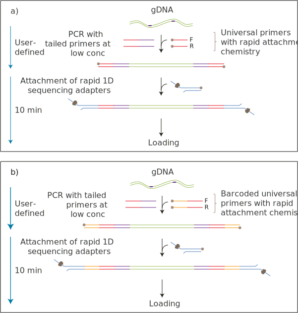
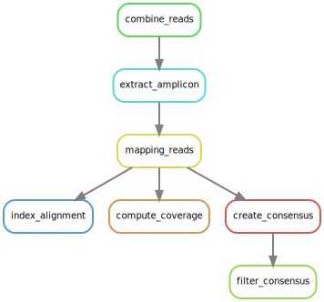

# ONT amplicon - Snakemake workflow
> create consensus sequence from ONT amplicon sequencing

## Data generation
This Snakemake workflow was built to create consensus sequences from Nanopore sequencing using the four-primer PCR protocol. This type of library preparation and sequencing yields sequences spanning the whole amplicon (including the user-defined primer sequences).



Since raw sequencing data is split across multiple compressed fastq files, they have to be combined first into one (e.g. by using `zcat`).

## Software required
Listed below are all primary software tools (without dependencies) and their version which was used to establish the workflow. All could be installed (including required dependencies) via the package manager Conda.  
They are also listed in the [`environment.yml`](environment.yml) document.  

**snakemake-minimal** v7.24.2
**seqkit** v2.3.1
**minimap2** v2.24
**samtools** v1.16.1
**prinseq** v0.20.4

## Rules
The workflow is divided into seven different steps, also called rules in Snakemake and a pseudo-rule (all) which combines all rules.  
The following figure shows a directed acyclic graph (DAG) which helps visualise the rules and how they are connected by their input and outputs.  




This plot can be created by executing `snakemake --rulegraph | grep -v "\-> 0\|0\[label = \"all\"" | dot -Tsvg -o figures/dag.svg`.

### all
This pseudo-rule lists all files that should be created and combines all rules explained below.  
Running this rule executes all processes at once for the samples and parameter values specified in [`config file`](config.yml). It is the simplest way to execute the whole workflow and can be run using the following command:  
```
snakemake --cores 8
```

### extract_amplicon

### mapping_reads

### index_alignment

### compute_coverage

### create_consensus

### filter_consensus

## Snakemake usage and documentation
For further Snakemake documentation and different ways to execute parts or the whole snakemake workflow see the [Snakemake documentation](https://snakemake.readthedocs.io/en/stable/).  