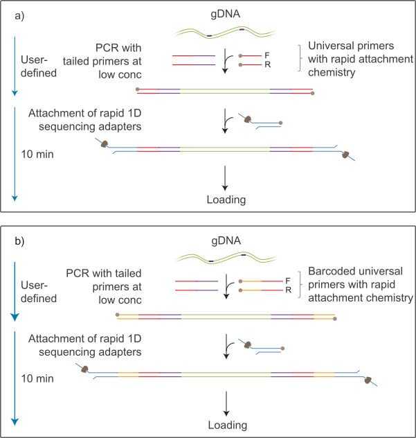

# ONT amplicon - Snakemake workflow

> create consensus sequence from Oxford Nanopore Technologies (ONT) amplicon sequencing

## Data generation

This Snakemake workflow was built to create consensus sequences from Nanopore sequencing using the four-primer PCR protocol. This type of library preparation and sequencing yields sequences spanning the whole amplicon (including the user-defined primer sequences).



## Config file required

Different parameter values have to be specified and provided in the [config file](config/config.yml).

## Metadata required

Before we can run the Snakemake workflow, metadata for all samples which should be processed has to be listed in the [`config/samples.tsv`](config/samples.tsv) table.  
Required columns are:  

- `sample_name` which will be the filename and part of the fasta header of the output  
- `run_name`, `flowcell_name`, and `barcode_name` are the exact directory names where the raw data is stored  

On timavo, the final path to the raw fastq files is:  
`/data/GridION/GridIONOutput/{run_name}/{flowcell_name}/*/fastq_pass/{barcode_name}/`

## Software required

Listed below are all primary software tools (without dependencies) and their version which was used to establish the workflow. All could be installed (including required dependencies) via the package manager Conda.  
They are also listed in the [`environment.yml`](environment.yml) document.  

**snakemake-minimal** v7.25.0  
**pandas** v1.5.3  
**seqkit** v2.4.0  
**minimap2** v2.24  
**samtools** v1.16.1  
**prinseq** v0.20.4  

On timavo all these tools are installed in the ONT_amplicon environment which can be activated with `conda activate ONT_amplicon`.

## Rules

The workflow is divided into seven different steps, also called rules in Snakemake and a pseudo-rule (all) which combines all rules.  
The following figure shows a directed acyclic graph (DAG) which helps visualize the rules and how they are connected by their input and outputs.  


This plot can be created by executing:  
`snakemake --rulegraph | grep -v "\-> 0\|0\[label = \"all\"" | dot -Tsvg -o figures/dag.svg`

### all

This pseudo-rule lists all files that should be created and combines all rules explained below.  
Running this rule executes all processes at once for the parameter values specified in the [config file](config/config.yml) and the samples listed in the [samples file](config/samples.tsv). It is the simplest way to execute the whole workflow and can be run using the following command:  

```bash
snakemake --cores 8
```

### combine_reads

The output from ONT sequencing are multiple fastq files per sample. This rule first combines all of these and stores them in the `reads_raw` directory.

### extract_amplicon

Using the primer sequences provided, the inner part of the amplicon (without the primer part) is extracted from the raw sequencing reads using [`seqkit amplicon`](https://bioinf.shenwei.me/seqkit/usage/#amplicon).  
There are no mismatches allowed but [degenerate bases](https://www.bioinformatics.org/sms/iupac.html) are supported.  
This filtering method is quite strict and might reduce the dataset a fair bit. But it's the only read/quality filtering step done on the raw data in this workflow.

### mapping_reads

Using [minimap2](https://github.com/lh3/minimap2) the remaining reads are mapped against a user-provided reference sequence(s).  
If multiple reference sequences are provided the final results may be more than one consensus sequence (can happen if more than one virus is present for example).  
It was intended that the reference sequences span exactly the part of interest (also without the primer binding site) but that could be changed in the future. If that's the case just remove the `-a` from the `samtools consensus` call in the [create_consensus](https://github.com/medvir/ONT_amplicon/blob/80569f2c3d35f05b189fbe0ec8a88a3ed03bf1d6/Snakefile#L76) rule.

### index_alignment

To inspect the bam file created with the previous rule, one might need an index of it. This rule creates that using `samtools index`.  
This is mainly a troubleshooting aid and could maybe be removed in the future.

### compute_coverage

To later have an idea of how many sequencing reads a consensus sequence is covered by, two files are created with this rule:  

- `*_aln_depth.tsv` list the read depth at each position of the reference sequence(s), using [`samtools depth`](http://www.htslib.org/doc/samtools-depth.html)  
- `*_aln_coverage.tsv` lists some coverage statistics, using [`samtools coverage`](http://www.htslib.org/doc/samtools-coverage.html)  

### create_consensus

Using the [`samtools consensus`](http://www.htslib.org/doc/samtools-consensus.html) function, a (or multiple) consensus sequence(s) are created.  
There are two very important parameters:  

- `--het-fract` which is the threshold for ambiguity codes, if set to 0.25 an ambiguous nucleotide is inserted if more than one nucleotide is observed in more than 25% of the mapped reads at one position  
- `--min-depth` is the minimum read depth required to make a call, else an "N" is inserted at that position  

`--min-depth` itself is defined by two parameters specified in the [`config file`](config.yml):  

- `min_depth_factor` defines the initial minimal depth ($min\\_depth = \frac{mapped\\_reads}{min\\_depth\\_factor}$) to set a variable threshold based on how many reads were mapped per sample, this accounts for variability in sequenced reads (has to be an integer)  
- `min_depth_reads` defines minimal depth to fall back when the min_depth calculated as described above is lower than this threshold  

The calculation of the min_depth can be summarised as follows:  
$min\\_depth = max(\frac{mapped\\_reads}{min\\_depth\\_factor}, min\\_depth\\_reads)$

### filter_consensus

The raw consensus sequence(s) are filtered using [`prinseq`](https://prinseq.sourceforge.net/manual.html) to remove low-covered or incomplete consensus sequences and remove eventual duplicates.  

- `ns_max_p` is the threshold to filter consensus sequences with more than that percentage of Ns

## Possible issues

### No consensus sequence

Few sequencing reads in combination with the strict [`extract_amplicon`](#extract_amplicon) rule could lead to not meeting the minimal coverage criterea and therefore no consensus sequence.  
Another possibility could be that there is no optimal reference sequence provided. In that case, the fasta file containing reference sequences can be extended with a suitable reference sequence.

### Multiple consensus sequences

It's possible that the final result from a sample is multiple consensus sequences. Explanations could be:  

- multiple infections  
- multiple close reference sequences present and the consensus sequences differ slightly (likely due to sequencing errors)  
- contamination from other sample(s) which is not filtered by the min_depth criteria  

## Snakemake usage and documentation

For further Snakemake documentation and different ways to execute parts or the whole snakemake workflow see the [Snakemake documentation](https://snakemake.readthedocs.io/en/stable/).  